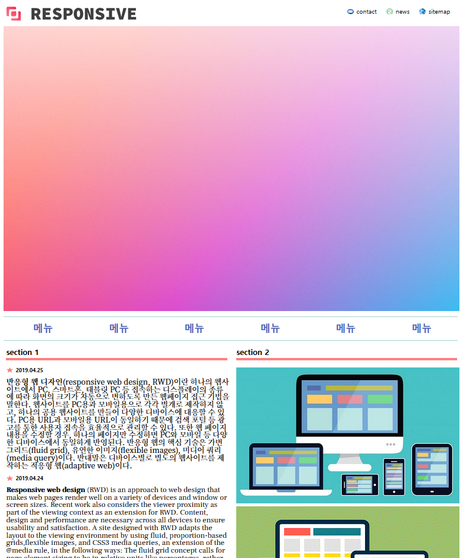
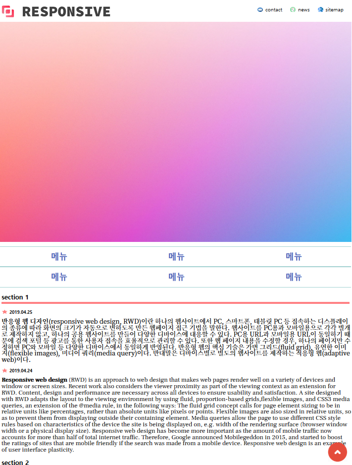
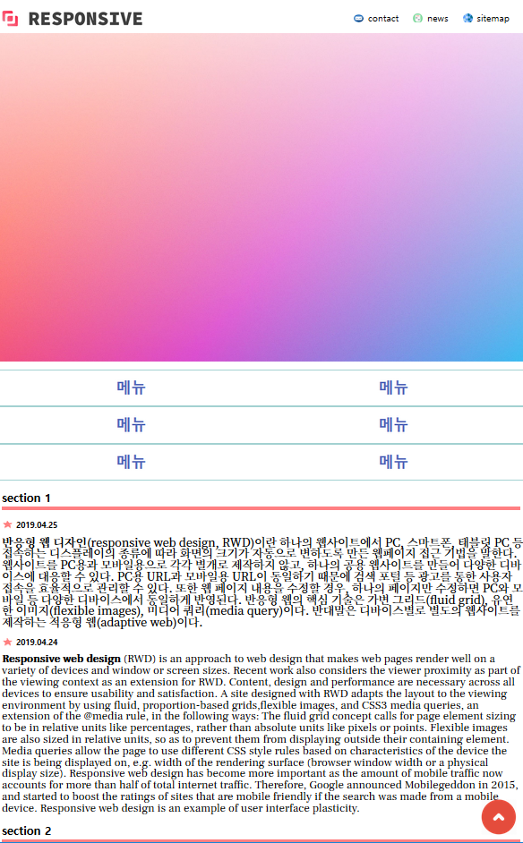
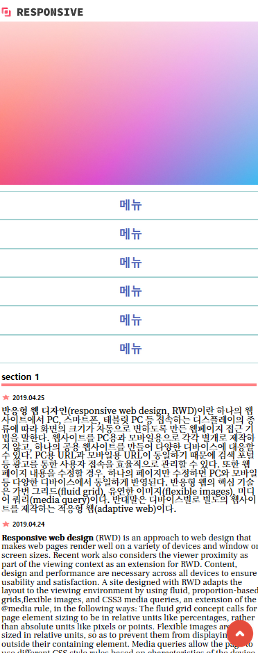

# 반응형 WEB PAGE

## 1. 개요

HTML/CSS 를 활용한 WEB PAGE 입니다.
화면 크기에 맞게 레이아웃이 배치되는 반응형 페이지 입니다.

 
 

## 2. 사용 언어 및 도구

- HTML
- CSS
- eclipse

## 3. 실행 이미지

## 4. 보안해야할 점

- HTML/CSS, 반응형 기능에만 중점을 뒀기 때문에 내용에 알맹이가 없습니다.
